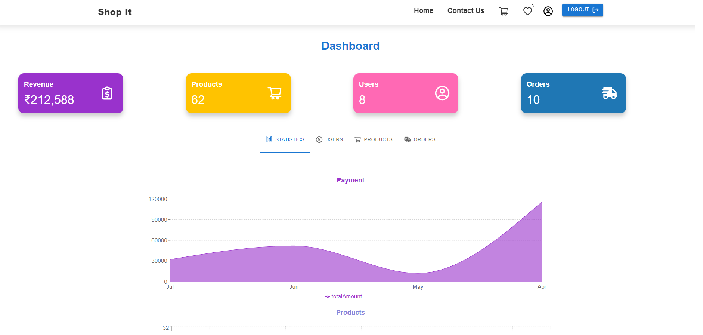
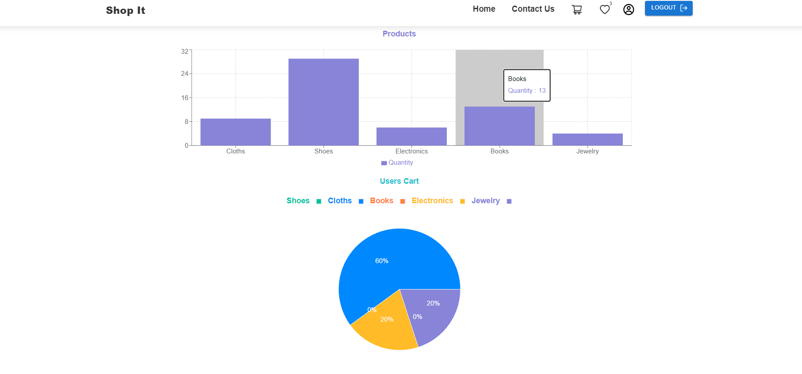
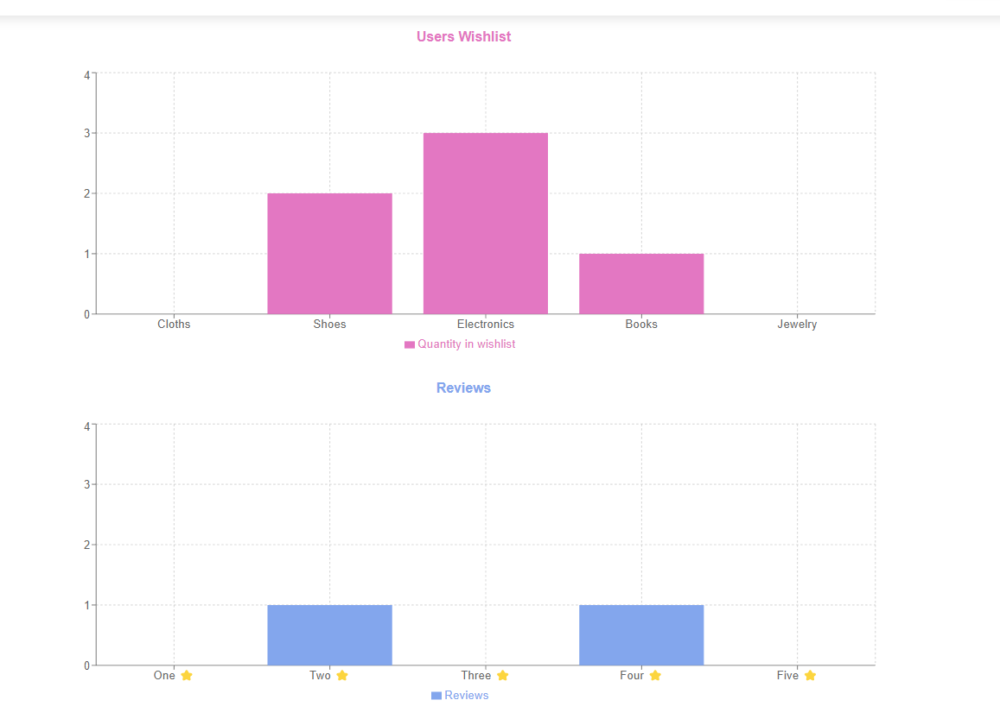
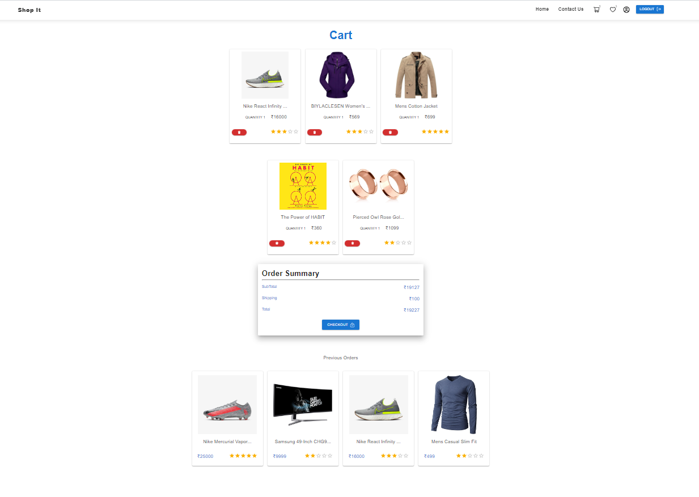
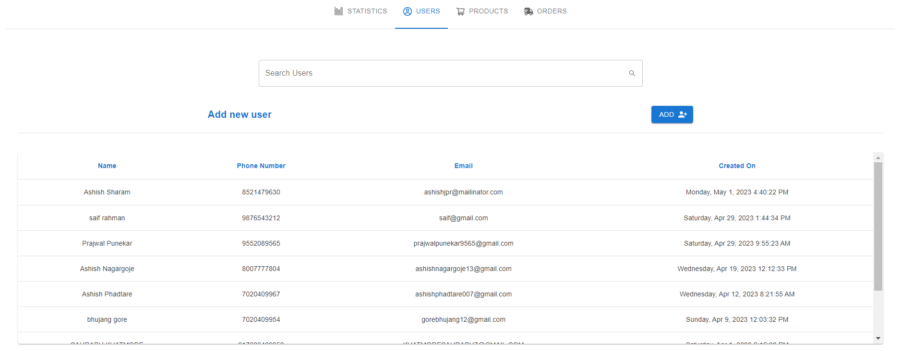
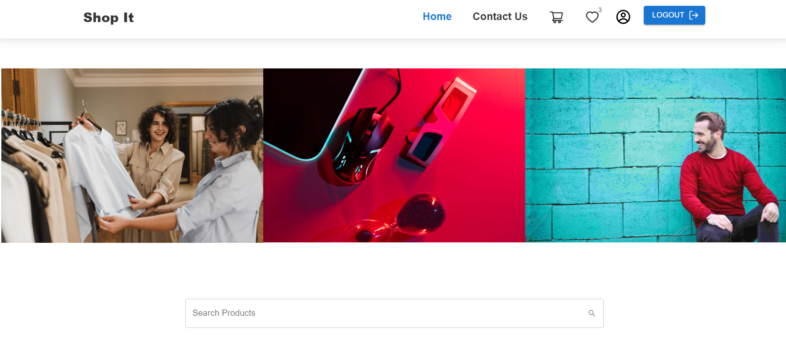
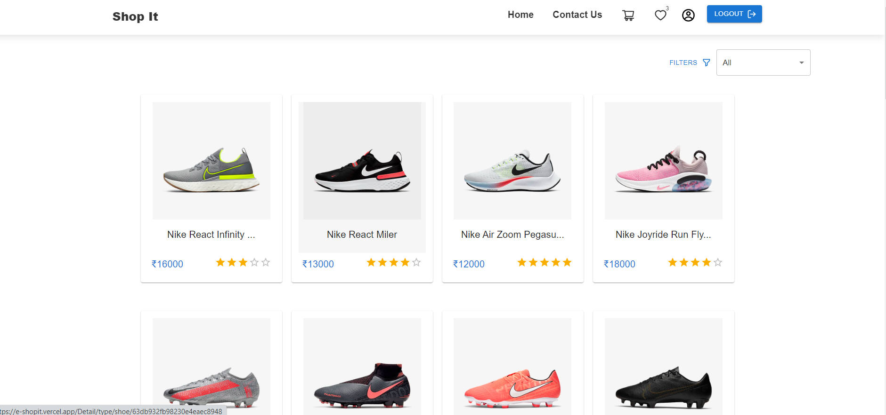
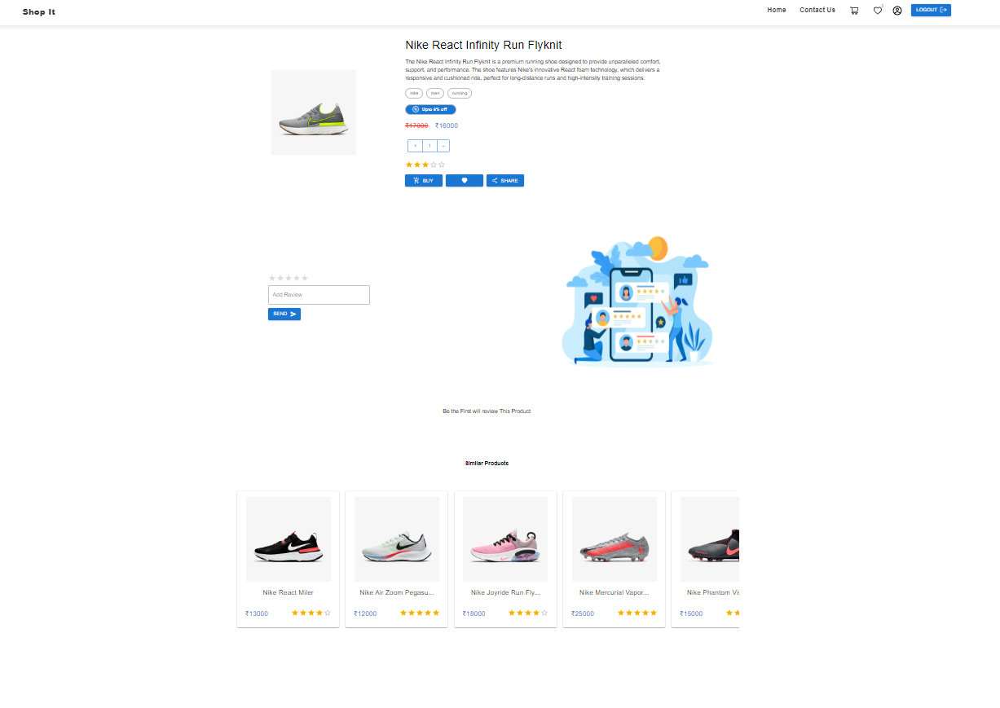
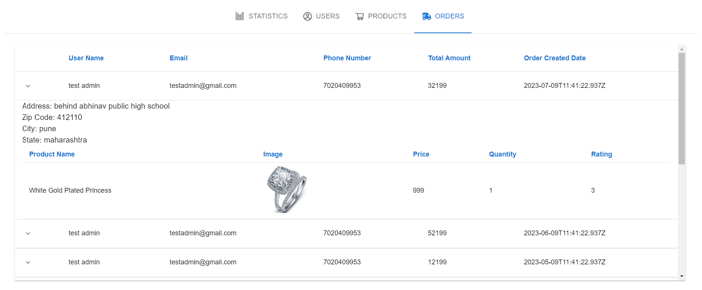
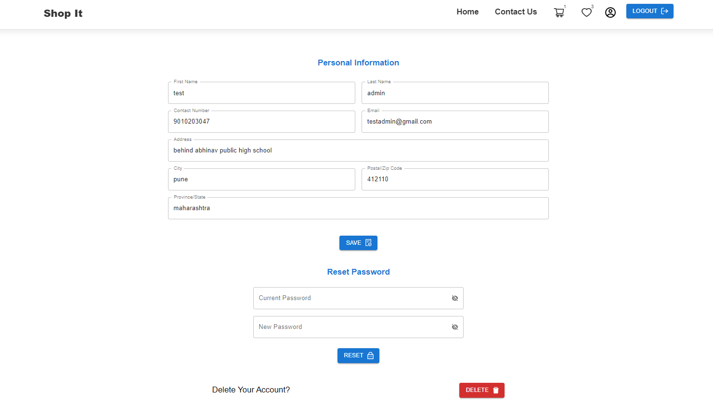

# Mern-Stack-Ecom-Project-Frontend

Mern-Stack-Ecom-Project-Frontend is the frontend of an e-commerce web application built with ReactJS ,Material UI, ContextAPI, React-router-dom

## Features

- User authentication and authorization(JWT)
- Admin dashboard for managing products, orders, users and to show statistics
- Payemnt Gateway
- Mail Service
- Forgot Password & Reset Password
- Product listing and search
- Product details and reviews
- Cart management
- Order history

## Tech Stack
- MongoDB
- ReactJS
- NodeJS
- ExpressJS
## Images

## Backend

The backend of the application is built with NodeJS and ExpressJS and uses a MongoDB database to store the product and user data. The source code for the backend can be found at [https://github.com/zshan-code/Mern-Stack-Ecom-Project-Backend.git](https://github.com/zshan-code/Mern-Stack-Ecom-Project-Backend.git).
